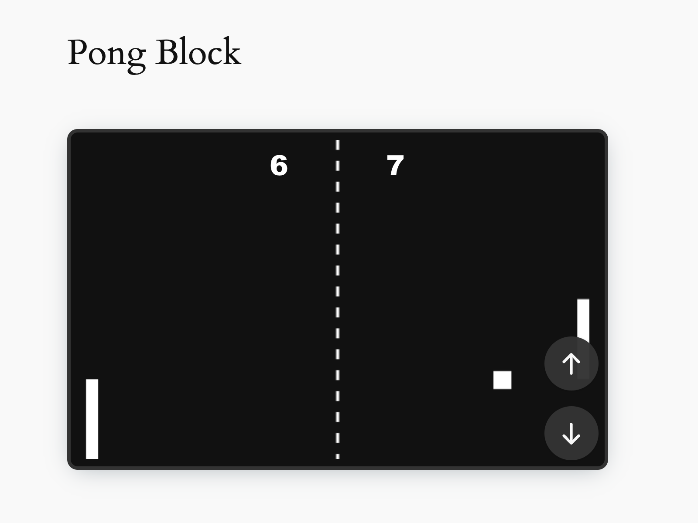
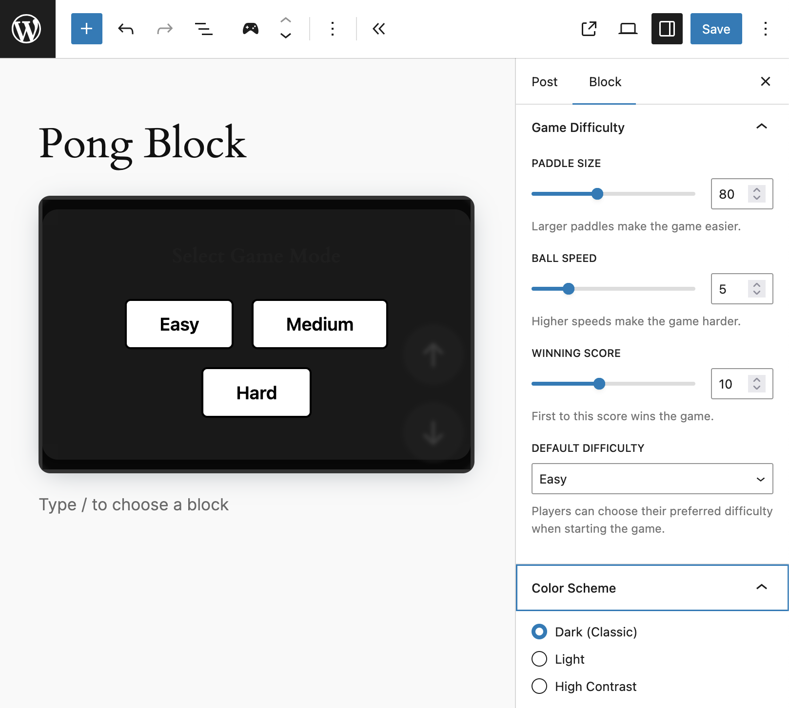

# Pong Block for WordPress

     

> Bring the classic Pong arcade game to your WordPress site!

## Overview

Pong Block is a Gutenberg block that lets visitors play Pong against a computer opponent, on any post or page. Designed for accessibility, customization, and fun.

## Features

- **Single Player Pong:** Classic gameplay—player vs Computer AI.
- **Keyboard and Touch Controls:** Use arrow keys or big on-screen buttons for mobile/tablet play.
- **Configurable Difficulty:** Adjust paddle size, ball speed, and winning score from the sidebar.
- **Color Schemes:** Choose from Dark (classic), Light, or High Contrast for best accessibility and style.
- **Accessible Overlays:** Start, Instructions, and Winner overlays are labeled, focus-managed, and fully screen reader friendly.
- **Fully Localizable:** All interface and instructions are ready for translation.
- **Responsive Layout:** Game scales to any device, with touch controls optimized for mobile comfort.
- **No Script Bloat:** Frontend JS loads only if block is present; clean and efficient.
- **WordPress Playground Ready:** Try it instantly in Playground!

## Usage

1. Insert the **Pong Block** anywhere in your post/page.
2. Click the block to preview/play live in the editor.
3. Use the block sidebar to adjust:
    - **Paddle Size:** (40–140) Larger is easier.
    - **Ball Speed:** (3–12) Faster is harder.
    - **Winning Score:** (3–20) First to this score wins.
    - **Color Scheme:** Dark/Light/High Contrast for best readability.
4. Publish and visitors can play!

## Accessibility

- All overlays and controls are operable via keyboard and accessible to screen readers.
- Game overlays auto-focus important buttons.
- Color palettes exceed WCAG AA/AAA contrast ratio requirements, especially High Contrast mode.
- Full i18n for assistive technologies.

## Customization

See block sidebar controls for live difficulty adjustment and theme changes.

## Development

- `npm install`
- `npm run build` or `npm run start`
- Requires `@wordpress/scripts` and Node.js v18+.
- See [CONTRIBUTING.md](./CONTRIBUTING.md) for branch/release flow.

## Support Level

**Active:** I am actively working on this and expect to continue work for the foreseeable future including keeping tested up to the most recent version of WordPress.  Bug reports, feature requests, questions, and pull requests are welcome.

## Changelog

A complete listing of all notable changes to Pong Block are documented in [CHANGELOG.md](https://github.com/jeffpaul/pong-block/blob/develop/CHANGELOG.md).

## Contributing

Please read [CODE_OF_CONDUCT.md](https://github.com/jeffpaul/pong-block/blob/develop/CODE_OF_CONDUCT.md) for details on our code of conduct, [CONTRIBUTING.md](https://github.com/jeffpaul/pong-block/blob/develop/CONTRIBUTING.md) for details on the process for submitting pull requests to us, and [CREDITS.md](https://github.com/jeffpaul/pong-block/blob/develop/CREDITS.md) for a listing of maintainers of, contributors to, and libraries used by Pong Block.
